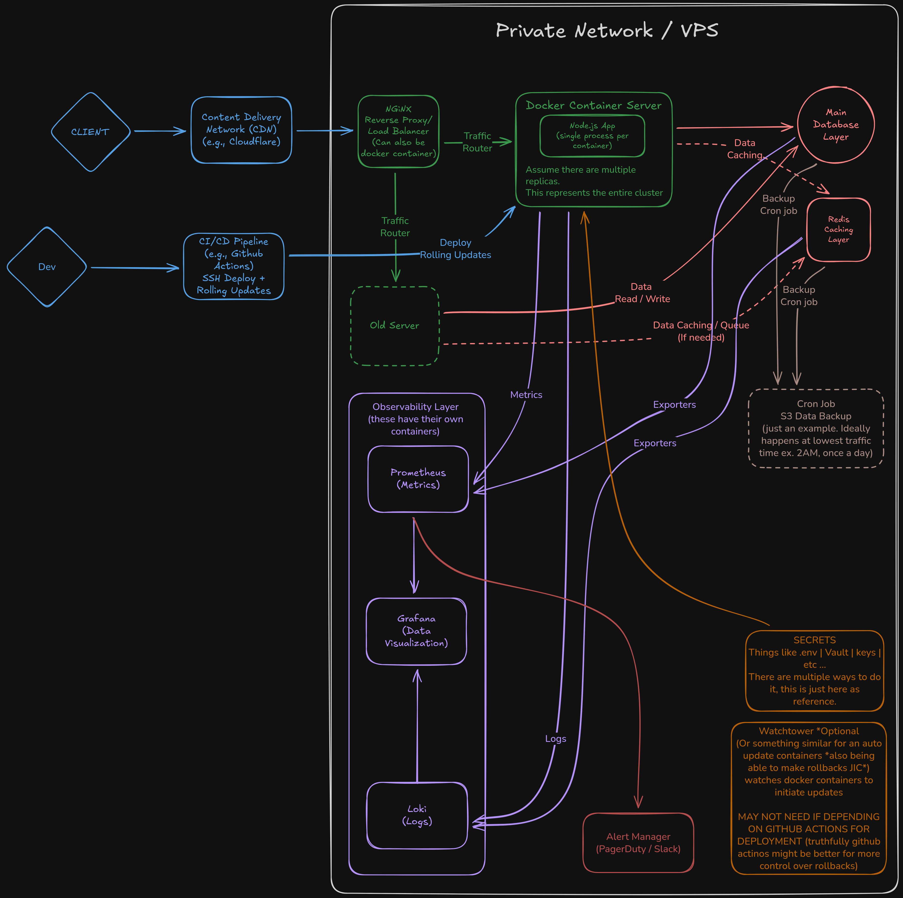

# Node.js Docker Starter

A production-ready Docker setup for Node.js apps with nginx load balancing, PostgreSQL, and Redis.

## What This Is

A template for containerized Node.js applications. Comes with:

- Express 5 API with TypeScript
- Nginx reverse proxy with rate limiting
- PostgreSQL 15 database
- Redis 7 cache
- Docker Compose for orchestration
- Horizontal scaling (3 replicas by default)

## Visual Diagram (Excalidraw)
(https://excalidraw.com/#json=R3eT5g4VDLOs_rtnTqt9H,DMZJk-e_blmapSVUPWWYFA)

## Quick Start

```bash
# Clone and run
docker-compose up --build

# Hit the endpoints
curl http://localhost/health
curl http://localhost/api
```

## Project Structure

```
.
├── docker-compose.yml        # Production compose file
├── docker-compose.dev.yml    # Dev overrides (hot reload)
├── nginx/
│   └── nginx.conf            # Reverse proxy config
└── nodeapp/
    ├── Dockerfile            # Multi-stage production build
    ├── Dockerfile.dev        # Dev container
    ├── src/
    │   └── index.ts          # Express app
    ├── package.json
    └── tsconfig.json
```

## Endpoints

| Route | Description |
|-------|-------------|
| `/health` | Health check, returns status and timestamp |
| `/` | Basic hello world |
| `/api` | Returns hostname (useful for seeing load balancing) |
| `/api/db` | Shows database connection info |
| `/api/cache` | Shows Redis connection info |
| `/metrics` | Shows Redis connection info |

## Configuration

Environment variables in `docker-compose.yml`:

```yaml
environment:
  - NODE_ENV=production
  - PORT=3000
  - DATABASE_URL=postgresql
  - REDIS_URL=redis
```

## Scaling

Default runs 3 replicas. Change it:

```yaml
deploy:
  replicas: 5
```

Nginx handles the load balancing automatically.

## Rate Limiting

API routes are rate limited at 100 requests/minute per IP. Health checks bypass this. Edit `nginx/nginx.conf` to adjust:

```nginx
limit_req_zone $binary_remote_addr zone=api_limit:10m rate=100r/m;
```

## Development

For hot reload during development:

```bash
docker-compose -f docker-compose.yml -f docker-compose.dev.yml up
```

This mounts your source files and uses tsx watch.

## Services

| Service | Port | Purpose |
|---------|------|---------|
| proxy | 80 | Nginx reverse proxy |
| api | 3000 (internal) | Node.js app (scaled) |
| database | 5432 | PostgreSQL |
| cache | 6379 | Redis |

## TODO

Things that could be added:

- Read replica database
- Container monitoring (Watchtower)
- Alerting (PagerDuty, Slack)

## Notes

- Database credentials are hardcoded for local dev. Use secrets in production.
- SSL certs commented out but ready to enable

## License

Do whatever you want with it, I literally don't care.
